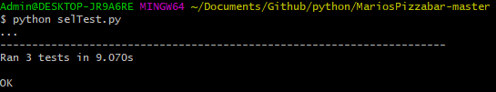

## Assignment number 8 in Test
This is selenium, I've written this in Python3 and i've put the requirements in a txt file for you to install.

First run this command ```pip3 install -r requirements```

Then you need to run the flask server in one terminal, can be done like this ```python flask_module/app.py```

and then you need to run selenium test in another terminal like this, ```python3 appTest.py -v```

I use Chrome 73.0.3683.68, and supplied the necessary driver in the folder here. You can replace it with whatever you use.

### Test results


